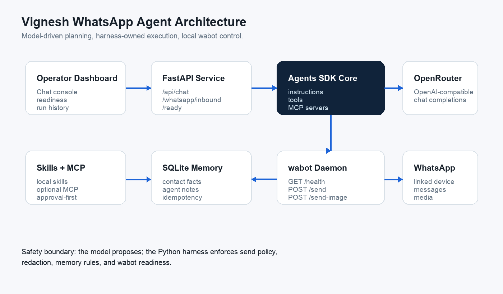
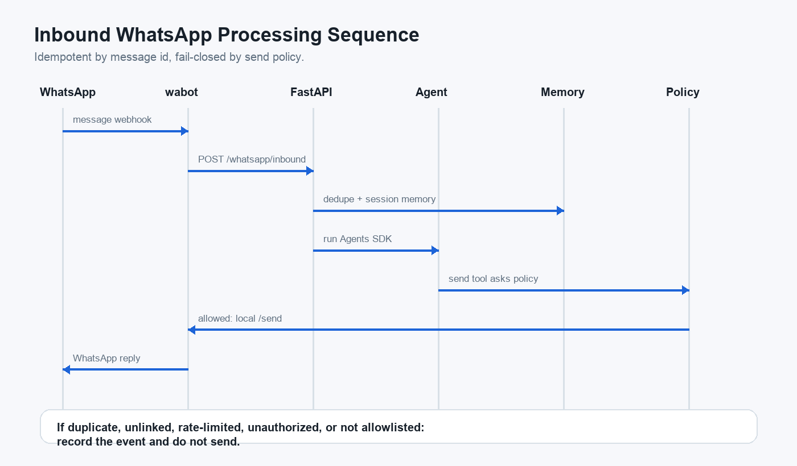

# Vignesh WhatsApp Agent

Vignesh is a VPS-ready WhatsApp automation agent built around the OpenAI Agents SDK, OpenRouter, and [`wabot`](https://github.com/TeddyJubu/wabot). It is designed to run locally first, then upload cleanly to the SSH host named `vignesh`.



## What It Does

- Runs an Agents SDK agent behind a FastAPI service.
- Uses OpenRouter through the OpenAI-compatible Chat Completions API.
- Treats `wabot` as the primary side-effect tool for WhatsApp.
- Keeps durable local memory in SQLite: contact facts, agent notes, processed inbound ids, runs, and tool events.
- Supports local skills under `skills/*/SKILL.md`.
- Supports optional MCP servers through `VIGNESH_MCP_CONFIG`.
- Exposes a small operator dashboard at `/`.
- Defaults to `dry_run` send policy so fresh installs cannot send WhatsApp messages by accident.

## Architecture



The model can plan and choose tools, but the Python harness owns execution. WhatsApp sends go through a narrow `wabot` client that checks send policy and daemon readiness before calling `/send` or `/send-image`.

```text
Operator / wabot inbound webhook
  -> FastAPI control plane
  -> Agents SDK runner
  -> OpenRouter model
  -> guarded tools
  -> local wabot daemon
  -> WhatsApp linked device
```

## Local Quickstart

```bash
uv sync --all-extras
cp .env.example .env
uv run python main.py
```

Open [http://127.0.0.1:8787](http://127.0.0.1:8787).

With no `OPENROUTER_API_KEY`, the service runs in offline mode. This is intentional: the app can boot, render, and test without network credentials.

## Connect OpenRouter

Edit `.env`:

```bash
OPENROUTER_API_KEY=...
OPENROUTER_MODEL=openai/gpt-5.2
OPENROUTER_BASE_URL=https://openrouter.ai/api/v1
```

Secrets stay in `.env`, which is ignored by git. Do not paste OpenRouter keys into chat prompts, skills, memory, README files, or MCP config.

## Connect wabot

Install and pair `wabot` first:

```bash
git clone https://github.com/TeddyJubu/wabot.git
cd wabot
./scripts/install.sh --prefix /usr/local
wa setup
wa doctor
wa health
```

The agent expects:

```bash
WABOT_ENDPOINT=http://127.0.0.1:7777
WABOT_TOKEN=...
WABOT_INBOUND_TOKEN=...
```

Use `WABOT_HTTP_ADDR=127.0.0.1:7777` for the daemon. Do not expose the wabot daemon directly to the public internet.

## Send Policy

The default is safe:

```bash
VIGNESH_SEND_POLICY=dry_run
```

Production recommendation:

```bash
VIGNESH_SEND_POLICY=allowlist
VIGNESH_ALLOWED_RECIPIENTS=+15550001111,+15550002222
```

`allow_all` exists for controlled environments, but it removes the recipient guard. Use it deliberately.

## HTTP API

```text
GET  /health
GET  /ready
POST /api/chat
GET  /api/runs
GET  /api/memory/{contact}
POST /whatsapp/inbound
```

Inbound webhook payload from `wabot`:

```json
{
  "id": "message-id",
  "timestamp": "2026-05-13T12:00:00Z",
  "from": "+15550001111",
  "chat": "+15550001111",
  "is_group": false,
  "push_name": "Vignesh",
  "text": "hello"
}
```

If `WABOT_INBOUND_TOKEN` is set, `/whatsapp/inbound` requires:

```text
Authorization: Bearer <WABOT_INBOUND_TOKEN>
```

Inbound messages are deduped by `id`.

## Tools

The core tool set is intentionally narrow:

- `wabot_health`
- `send_whatsapp_text`
- `send_whatsapp_image`
- `recall_contact_memory`
- `remember_contact_fact`
- `recall_agent_notes`
- `remember_agent_note`
- `list_local_skills`
- `read_local_skill`

Tool results and logs are redacted before persistence.

## Skills And MCP

Local skills live in:

```text
skills/<name>/SKILL.md
```

MCP servers are configured by JSON:

```bash
VIGNESH_MCP_CONFIG=./configs/mcp.example.json
```

Every example MCP server is disabled by default. Enable only trusted servers and keep privileged tools behind approval or an allowlist.

## VPS Deployment

On the VPS:

```bash
sudo APP_DIR=/opt/vignesh-agent APP_USER=vignesh ./scripts/bootstrap-vps.sh
sudo nano /opt/vignesh-agent/.env
sudo systemctl restart vignesh-agent
sudo journalctl -u vignesh-agent -f
```

From this local machine after the VPS is bootstrapped:

```bash
SSH_HOST=vignesh ./scripts/deploy-to-vignesh.sh
```

The systemd unit is in `deploy/systemd/vignesh-agent.service`.

## Verification

Offline checks:

```bash
uv run --with '.[dev]' ruff check .
uv run --with '.[dev]' python -m pytest -q
uv run python evals/run_local.py
```

Credentialed smoke checks, when the VPS is ready:

```bash
curl -fsS http://127.0.0.1:8787/health
curl -fsS http://127.0.0.1:8787/ready
wa doctor
wa health
```

Then use the dashboard to ask for a health check and a draft response before enabling real sends.

## Repository Layout

```text
src/vignesh_agent/
  agent.py      # Agents SDK orchestration
  api.py        # FastAPI app and webhook surface
  models.py     # OpenRouter and offline model wiring
  tools.py      # Agent tools and send policy checks
  memory.py     # SQLite memory and idempotency
  wabot.py      # HTTP client for wabot
static/         # Operator dashboard
skills/         # Local agent skills
configs/        # MCP config examples
deploy/         # systemd assets
scripts/        # VPS and diagram helpers
tests/          # Offline test suite
evals/          # Local eval harness
```

## Safety Notes

- Keep `.env`, `store.db`, `wabot.env`, and `sends.log` out of git.
- Back up `store.db`; it is the WhatsApp linked-device identity.
- Treat `logged_in=false` or `connected=false` as an operational incident.
- Keep `wabot` bound to loopback.
- Use allowlists for production sending.
- Rotate secrets if they ever appear in prompts, logs, memory, traces, or screenshots.

